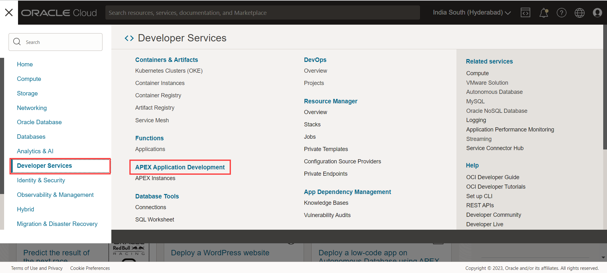
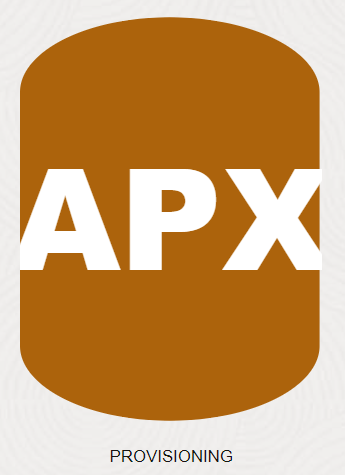

# Sign up for an APEX Workspace

## Introduction

Oracle APEX is a low-code application platform for Oracle Database. APEX Application Development, Autonomous Data Warehouse (ADW), Autonomous Transaction Processing (ATP), and Autonomous JSON Database are fully managed services, pre-integrated and pre-configured with APEX, for rapidly building and deploying modern data-driven applications in Oracle Cloud. Business users, citizen, and application developers can create enterprise apps 20X faster with 100X less code — without having to learn complex web technologies with just a browser. To start, you will need to decide on the service you are going to use for this workshop, and then create an APEX workspace accordingly. Continue reading further to learn which is the best service for you!

If you already have an APEX 22.1 Workspace provisioned, you can skip this lab.

Estimated Time: 5 minutes

Watch the video below for a quick walk through of the lab.

[](youtube:RcSCnZnDzDE)

### What is an APEX Workspace?
An APEX Workspace is a logical domain where you define APEX applications. Each workspace is associated with one or more database schemas (database users) which are used to store the database objects, such as tables, views, packages, and more. APEX applications are built on top of these database objects.

### How Do I Find My APEX Release?
To determine which release of Oracle APEX you are currently running, do one of the following:
* View the release number on the Workspace home page:
    - Sign in to Oracle APEX. The Workspace home page appears. The current release version displays in bottom right corner.

    
    

* View the About APEX page:
    - Sign in to Oracle APEX. The Workspace home page appears.
    - Click the Help menu at the top of the page and select About. The About APEX page appears.

  

### Where to Run the Lab
You can run this lab in any Oracle Database with APEX 22.1 installed. This includes the new APEX Application Development Service, the Oracle Autonomous Database, the free, "Development Only" apex.oracle.com service, your on-premises Oracle Database (providing APEX 22.1 is installed), on a third party cloud provider where APEX 22.1 is installed, or even on your laptop by installing Oracle XE or Oracle VirtualBox App Dev VM and installing APEX 22.1.

Below are steps on how to sign up for either an *APEX Application Development* Service, an *Oracle Autonomous Database* cloud service or *apex.oracle.com* service.
- The APEX Application Development Service is great if you would like to go with a flexible paid option that allows to concentrate your efforts on APEX development without worrying about the database management. It provides 1 OCPU and 1 TB and can be extended as needed.
- The Always Free Oracle Autonomous Database option is ideal for learning about the Oracle Database and APEX, and provides 1 OCPU and 20 GB of compressed storage. This service can also be utilized for production applications, and can readily be upgraded to a paid service as necessary.
- On the other hand, apex.oracle.com is also a free service; however, it is only designated for development purposes, and running production apps is not allowed.

For conducting labs in this workshop, either service can be utilized.

*Note*: Some of the features showcased in this lab are only available starting APEX 22.1.

Click one of the options below to proceed.

## **Option 1**: APEX Service
Oracle Application Development (APEX Service) is a low cost Oracle Cloud service offering convenient access to the Oracle APEX platform. Visit [https://apex.oracle.com/en/platform/apex-service/](https://apex.oracle.com/en/platform/apex-service/) to learn more about APEX service on Oracle Cloud.

In this part, you will create an Oracle APEX Application Development Service trial account. Once you have signed up for the service, you will create an *APEX Service*. The final step in the process is to provision Oracle APEX.

1.  Please [click this link to create your free account](https://signup.cloud.oracle.com/). When you complete the registration process, you'll receive an account with a $300 credit that you can utilize to create an APEX Service. You can then use any remaining credit to continue to explore the Oracle Cloud.

2.  Once the Signup process is complete, you will be logged in automatically to the Oracle Cloud Infrastructure (OCI) Console.
    -  In case you have closed the browser, you can always refer to the **Get Started Now with Oracle Cloud** email that you should have received to login to OCI Console.   
    Make a note of your **Username**, **Password**, and **Cloud Account Name**.

        

    - Alternatively, you can login to your Oracle Cloud account by accessing the following URL from your browser:       
    [https://cloud.oracle.com](https://cloud.oracle.com)

        Enter your **Cloud Account Name** in the input field and click the **Next** button.

        

        Enter your **User Name** and **Password** in the input fields, and click **Sign In**.

        

3. From the Cloud Dashboard, click on the hamburger menu on the upper-left corner. From the navigation menu, select **Developer Services** and then **APEX Application Development** or **APEX Instances**. The APEX Instances page appears.
    
    
    
4. At the top of the APEX Instances page, click the **Create APEX Service** button.

    
    
5. Select the **Always Free** option, enter **```SecretPassw0rd```** for the ADMIN password, then click **Create APEX Service**.
    
    
    
    
    
6. The APEX Instances Details displays again.

  When the provisioning process completes the APX logo turns from orange to green and the Launch APEX and Launch Database Actions buttons are enabled.
  
  
  
  
7. Before using a new APEX Service, you must set up your APEX Service instance by completing two tasks: create an initial APEX workspace and create an APEX user account.
  
    On the APEX Instance Details, click Launch APEX.
    
    
    
8. The Administration Services Sign In page appears. Enter the password for the Administration Services and click **Sign In to Administration**.
  The password is the same as the one entered for the ADMIN user when creating the APEX service: **```SecretPassw0rd```**
  

9. Click **Create Workspace**.

  

10. In the Create Workspace dialog, enter the following:

  | Property | Value |
  | --- | --- |
  | Database User | DEMO |
  | Password | **`SecretPassw0rd`** |
  | Workspace Name | DEMO |

  Click **Create Workspace**.

  

11. In the APEX Instance Administration page, click the **DEMO** link in the success message.         
  *Note: This will log you out of APEX Administration so that you can log into your new workspace.*

  

12. On the APEX Workspace log in page, enter **``SecretPassw0rd``** for the password, check the **Remember workspace and username** checkbox, and then click **Sign In**.

  

## **Option 2**: Oracle Autonomous Database

1.  Please [click this link to create your free account](https://signup.cloud.oracle.com/). When you complete the registration process, you'll receive an account with a $300 credit that you can utilize to create an APEX Service. You can then use any remaining credit to continue to explore the Oracle Cloud.

2.  Once the Signup process is complete, you will be logged in automatically to the Oracle Cloud Infrastructure (OCI) Console.
    -  In case you have closed the browser, you can always refer to the **Get Started Now with Oracle Cloud** email that you should have received to login to OCI Console.   
    Make a note of your **Username**, **Password**, and **Cloud Account Name**.

        

    - Alternatively, you can login to your Oracle Cloud account by accessing the following URL from your browser:       
    [https://cloud.oracle.com](https://cloud.oracle.com)

        Enter your **Cloud Account Name** in the input field and click the **Next** button.

        

        Enter your **User Name** and **Password** in the input fields, and click **Sign In**.

        

3. From within your Oracle Cloud environment, you will create an instance of the Oracle APEX Application Development Service.

    Click the **Navigation Menu** in the upper left, navigate to **Developer Services**, and select **APEX Instances**.

	

4. Select a Compartment and Click **Create APEX Service**.

    

5. Enable the **Always Free** option.
   Select **19c** for the database version.
   Enter **```SecretPassw0rd```** for the ADMIN password then click **Create APEX Service**.

    

6. After clicking **Create APEX Service**, you will be redirected to the APEX Application Development Details page for the new instance.

    Continue when the status changes from:

    

    to:

    

7.  Within your new APEX Application Development Service, APEX Workspace is not yet configured. Therefore, when you first access APEX, you will need to log in as an APEX Instance Administrator to create a workspace.

    Click **Launch APEX**.

    

    *Note: APEX Application Development Service is a paid service. You will be able to use APEX Service trial only if you have a new Free Cloud account or you are within the trial period. To Stop the APEX Service from consuming your trial credit, you need to stop the Autonomous Database behind it. Click on the Database name under **APEX Instance Information** tab in the **APEX Instance Details** page:*

    

    *Click **More Actions** and then **Stop***

    

8.  Enter the password for the Administration Services and click **Sign In to Administration**.     
    The password is the same as the one entered for the ADMIN user when creating the APEX instance: **```SecretPassw0rd```**

    

9.  Click **Create Workspace**.

    

10. In the Create Workspace dialog, enter the following:

    | Property | Value |
    | --- | --- |
    | Database User | DEMO |
    | Password | **`SecretPassw0rd`** |
    | Workspace Name | DEMO |

    Click **Create Workspace**.

    

11. In the APEX Instance Administration page, click the **DEMO** link in the success message.         
    *Note: This will log you out of APEX Administration so that you can log into your new workspace.*

    

12. On the APEX Workspace log in page, enter **``SecretPassw0rd``** for the password, check the **Remember workspace and username** checkbox, and then click **Sign In**.

    


## **Option 3**: apex.oracle.com
Signing up for apex.oracle.com is simply a matter of providing details on the workspace you wish to create and then waiting for the approval email.

1. Go to [https://apex.oracle.com](https://apex.oracle.com.).
2. Click **Get Started for Free**.

    

3. Scroll down until you see details for apex.oracle.com.  Click **Request a Free Workspace**.

    

4. On the Request a Workspace dialog, enter your Identification details – First Name, Last Name, Email, Workspace.
   *Note: For workspace, enter a unique name, such as first initial and last name.*

    Click **Next**.

    

5. Complete the remaining wizard steps.

6. Check your email. You should get an email from Oracle APEX within a few minutes.  
   *Note: If you don’t get an email go back to Step 3 and make sure to enter your email correctly.*

    Within the email body, click **Create Workspace**.

    

7. Click **Continue to Sign In Screen**.
8. Enter your password, and click **Apply Changes**.
9. You should now be in the APEX Builder.

    


## **Summary**

At this point, you know how to create an APEX Workspace and you are ready to start building amazing apps, fast.

You may now **proceed to the next lab**.

## **Acknowledgements**

 - **Author** - Apoorva Srinivas, Senior Product Manager
 - **Contributors** - Salim Hlayel, Arabella Yao, Jaden McElvey
 - **Last Updated By/Date** - Apoorva Srinivas, Senior Product Manager, May 2022

## Need Help?
Please submit feedback or ask for help using our [LiveLabs Support Forum](https://community.oracle.com/tech/developers/categories/oracle-apex-development-workshops). Please click the **Log In** button and login using your Oracle Account. Click the **Ask A Question** button to the left to start a *New Discussion* or *Ask a Question*.  Please include your workshop name and lab name.  You can also include screenshots and attach files.  Engage directly with the author of the workshop.

If you do not have an Oracle Account, click [here](https://profile.oracle.com/myprofile/account/create-account.jspx) to create one.
