# Improve the products page

## Introduction

In this lab, you will learn how to improve the Products page by adding new facets and customizing the cards.

Once you have finished the workshop and updated all the products as described in the steps, your page will look like the following image:
    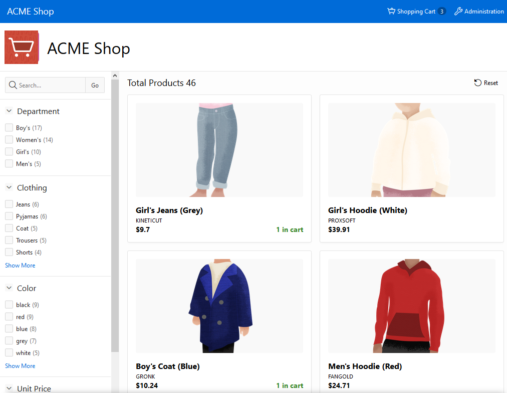

*Please note that customer can quickly identify the products that already have been added to the shopping cart.*

Estimated Time: 20 minutes
<!--
Watch the video below for a quick walk through of the lab.

[](youtube:N3Kd2XuudG4)
-->
### Objectives
In this lab, you will:
- Improve both Faceted Search and Cards region
- Add Dynamic Actions to the page


## Task 1: Reorder Facets

The **Products** page is where your customers can explore the products and select what they wish to buy.
As you can see, it's hard to find the products and it would be beneficial to see additional details related to the products.

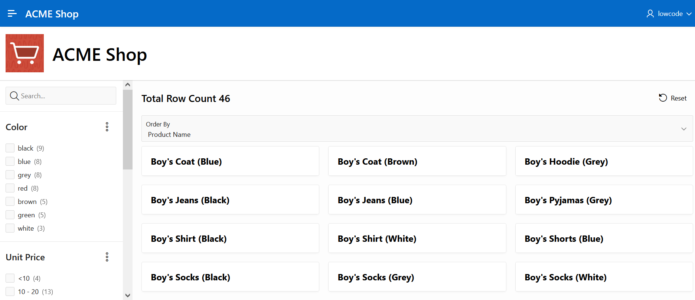

1. From the runtime application, navigate to the **Products** page in **Page Designer**.

    Given that you run this app from the APEX App Builder, you will find the Developer Toolbar at the bottom of the screen.
    *{Note: End users who log directly into the app will not see this toolbar.}*

    In the Developer Toolbar click **Edit Page 1**.

    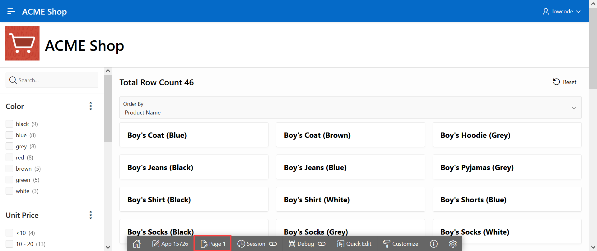
    
    Alternatively, you can also navigate back to the APEX App Builder tab in your browser manually by selecting the appropriate browser tab or window.   
    Once in the App Builder click **1 - Products**.

    
    
    You should now be in Page Designer with **Page 1: Products** loaded.


2. Unit price is not a common search criteria, so you want to put this facet at the bottom.
    In the Rendering tree (left pane), under Search, within Facets, click and hold **P1\_UNIT\_PRICE** and drag it down until it is under **P1\_COLOR\_ID**, then release the mouse. Reorder the facets to display as in this image.

    

## Task 2: Enhance the Faceted Search

1. In the Rendering tree (left pane), navigate to **Search**.
2. In the Property Editor (right pane), click **Attributes** and do the following:
    -   For Total Row Count Label - enter **Total Products**
    -   For Show Charts - select **No**

    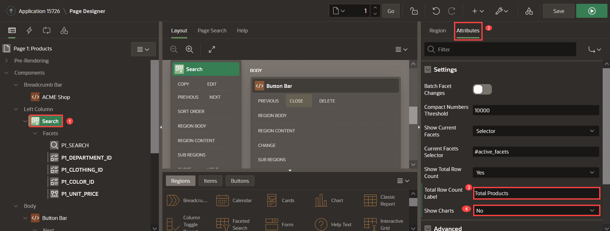    

## Task 3: Enhance the Cards Region
    
1.  In the Rendering tree (left pane), navigate to **Search Results** and in the Property Editor (right pane), do the following:
    - For SQL Query - enter the following SQL code:

        ```
        <copy>
        SELECT "PRODUCT_ID",
            "PRODUCT_NAME",
            "UNIT_PRICE",
            "PRODUCT_DETAILS",
            "PRODUCT_IMAGE",
            "IMAGE_MIME_TYPE",
            "IMAGE_FILENAME",
            "IMAGE_CHARSET",
            "IMAGE_LAST_UPDATED",
            "COLOR_ID",
            (
                    SELECT l1."COLOR"
                    FROM   "COLOR_LOOKUP" l1
                    WHERE  l1."COLOR_ID" = m."COLOR_ID") "COLOR_ID_L$1",
            "DEPARTMENT_ID",
            (
                    SELECT l2."DEPARTMENT"
                    FROM   "DEPARTMENT_LOOKUP" l2
                    WHERE  l2."DEPARTMENT_ID" = m."DEPARTMENT_ID") "DEPARTMENT_ID_L$2",
            "CLOTHING_ID",
            (
                    SELECT l3."CLOTHING"
                    FROM   "CLOTHING_LOOKUP" l3
                    WHERE  l3."CLOTHING_ID" = m."CLOTHING_ID") "CLOTHING_ID_L$3",
            b.brand
        FROM   "PRODUCTS" m,
            json_table (m.product_details, '$' columns ( brand varchar2(4000) path '$.brand') ) b
        </copy>
        ```
    - Under Appearance section:
        - Click **Template Options**. For Style - select **Style A**
      
        - Click **Ok**
        
2. Click **Attributes** and apply the following changes:
    
    - Under Appearance section:
        - For Layout - select **Grid**
        - For Grid Columns - select **Auto**
        
    - Under Title section:
        -   For Column - select **PRODUCT_NAME**

    - Under Subtitle section:
        - Set Advanced Formatting to **On**
        - For HTML Expression - enter the following:

            ```
            <copy>
            <small>&BRAND.</small><br />
            <b class="u-success-text u-pullRight" id="message_&PRODUCT_ID.">
            {if QUANTITY/} &QUANTITY. in cart {endif/}
            </b>
            <b>$&UNIT_PRICE.</b>
            </copy>
            ```

    - Under Media section:
        -   For Source - select **BLOB Column**
        -   For BLOB Column - select **PRODUCT_IMAGE**
        -   For Position - select **First**
        -   For Appearance - select **Widescreen**
        -   For Sizing - select **Fit**
        
    - Under Card section:
        -   For Primary Key Column 1 - select **PRODUCT_ID**

               

## Task 4: Create Actions
Customers need a way to shop the products, so in this task you will add an action to allow customers to learn more about the product.

1. Navigate to **Search Results** (left pane).
2. On Actions, right-click **Create Action**.

    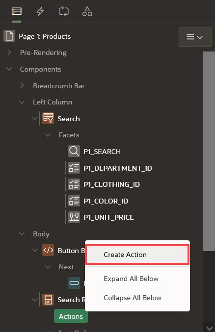

3. In the Property Editor (right pane), enter the following:
    -   For Type - select **Full Card**
    -   For Target - Click **No Link Defined** and do the following:
        - For Page - enter **18**.
        - For Set Items, enter:

            | Name | Value |
            | --- | --- |
            | P18\_PRODUCT\_ID | &PRODUCT_ID. |
             
        - For Clear Cache, enter **18**
        - Click **Ok**.

    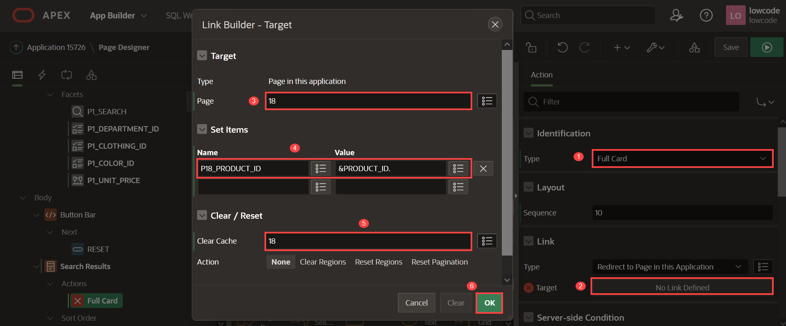

## Task 6: Add Dynamic Actions
In this task, you will create two dynamic actions:
- To show a success message when a product is added/edited/removed from the shopping cart.
- To update the badge and icon shown in the navigation bar after the customer has added/edited/removed a product from the shopping cart.

1. Navigate to **Dynamic Actions** tab (left pane).

2. Right-click **Dialog Closed** and click **Create Dynamic Action**.
     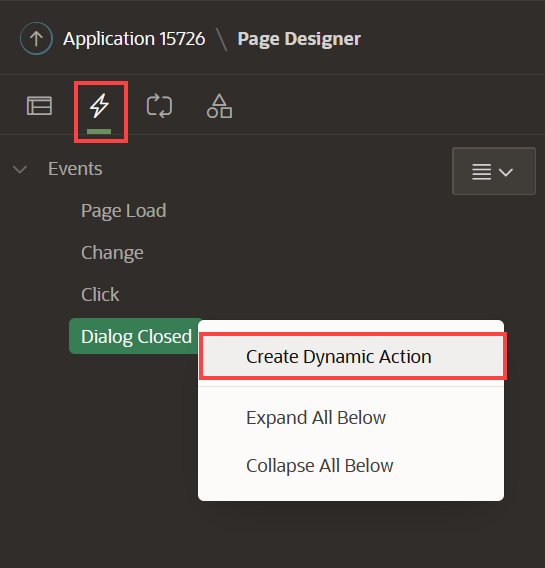  
3. In the Property Editor, enter the following:
    - Under Identification section:
        - For Name - enter **Show Success Message**
    - Under When section:
        - For Event - select **Dialog Closed**
        - For Selection Type - select **Region**
        - For Region - select **Search Results**
        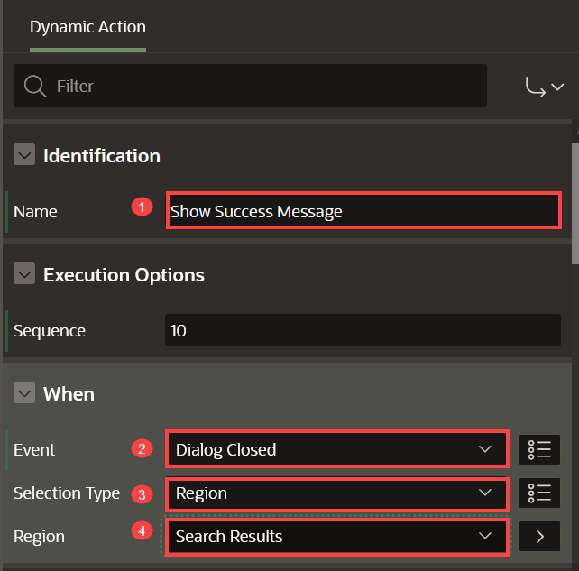
4. Navigate to **Refresh** Action.
    - Under Identification section:
        - For Action - select **Execute JavaScript Code**
    - Under Settings section:        
        - For Code - enter the following JavaScript Code:

            ```
            <copy>    
            var productAction   = this.data.P18_ACTION,
                productQuantity = this.data.P18_QUANTITY,
                productCard$  = apex.jQuery("#message_" + this.data.P18_PRODUCT_ID);

            if (productAction === 'ADD') {
                productCard$.text("Added " + productQuantity + " to cart!");
            } else if (productAction === 'EDIT') {
                productCard$.text("Updated quantity to " + productQuantity + "!");
            } else if (productAction === 'DELETE') {
                productCard$.text("Removed from cart!");
            }
            </copy>
            ```

5. Create a second dynamic action. Right-click **Dialog Closed** and click **Create Dynamic Action**.  
     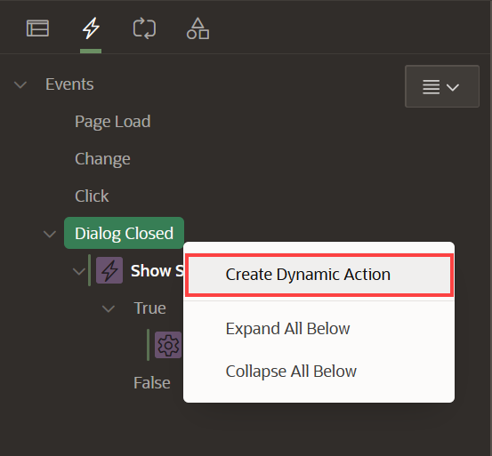
6. In the Property Editor, enter the following:    
    - Under Identification section:
        - For Name - enter **Update Shopping Cart Header**
    - Under When section:        
        - For Event - select **Dialog Closed**
        - For Selection Type - select **Region**
        - For Region - select **Search Results**     
    - Under Client-side Condition:
        - For Type - select **JavaScript expression**
        - For JavaScript Expression, enter the following:

            ```
            <copy>
            parseInt(this.data.P18_SHOPPING_CART_ITEMS) > 0
            </copy>
            ```
            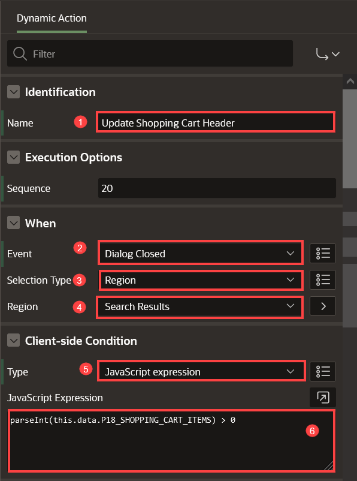

7. Navigate to **Refresh** Action.
    - Under Identification section:
        - For Action - select **Execute JavaScript Code**
    - Under Settings section:        
        - For Code - enter the following JavaScript Code:

            ```
            <copy>
            // Update Badge Text
            apex.jQuery(".js-shopping-cart-item .t-Button-badge").text(this.data.P18_SHOPPING_CART_ITEMS);

            // Update Icon
            apex.jQuery(".js-shopping-cart-item .t-Icon").removeClass('fa-cart-empty').addClass('fa-cart-full');
            </copy>
            ```
8. Create an opposite action. In the Dynamic Actions tab (left pane), navigate to the newly dynamic action.
9. Right-click **Execute JavaScript Code** and click **Create Opposite Action**.
     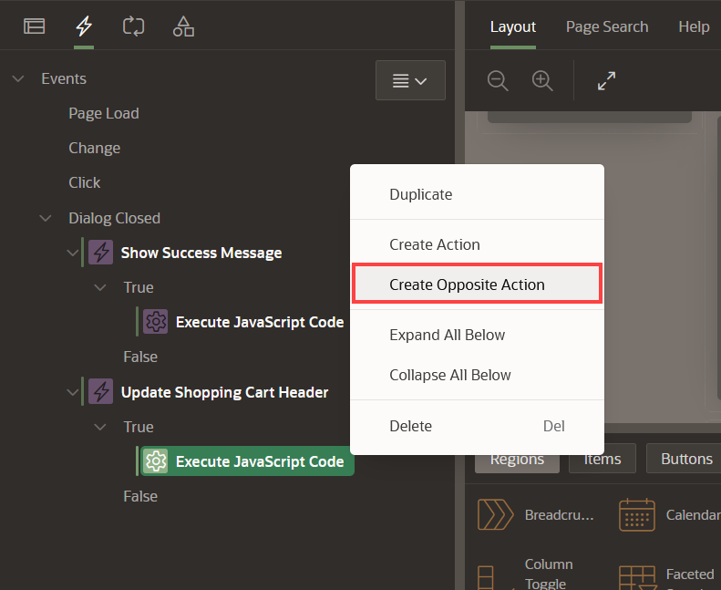

10. Navigate to **Execute JavaScript Code** Action.
    - Under Identification section:
        - For Action - select **Execute JavaScript Code**
    - Under Settings section:        
        - For Code - enter the following JavaScript Code:

            ```
            <copy>
            // Update Badge Text
            apex.jQuery(".js-shopping-cart-item .t-Button-badge").text('');

            // Update Icon
            apex.jQuery(".js-shopping-cart-item .t-Icon").removeClass('fa-cart-full').addClass('fa-cart-empty');
            </copy>
            ```
11. Click **Save and Run Page** to view your updated **Products** page.
      


You now know how to enhance faceted search and cards region. You may now **proceed to the next lab**.

## Acknowledgments

- **Author** - Apoorva Srinivas, Senior Product Manager; Monica Godoy, Principal Product Manager
- **Contributors** - Shakeeb Rahman, Architect
- **Last Updated By/Date** - Apoorva Srinivas, Senior Product Manager, July 2022
