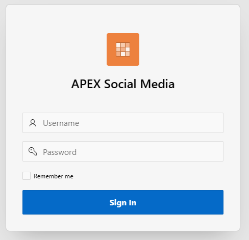
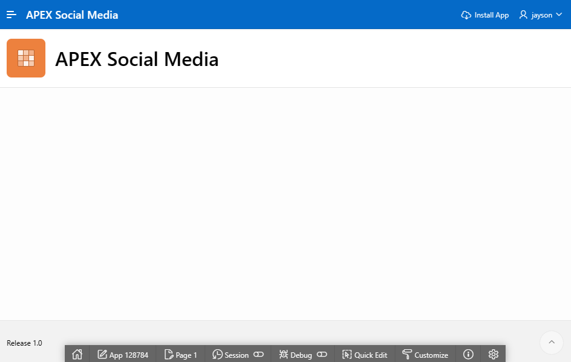
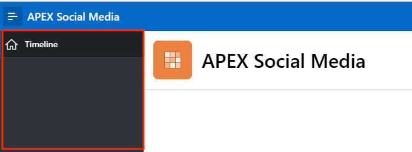

# Create an APEX Application

In this lab, you will learn to create a blank APEX application that will be used to build the Social Media App.

## Introduction
Now that you are logged into your workspace, you can start creating APEX applications. In this lab, you build a simple application for the Social Media App. Keep in mind that APEX is great for a variety of apps, from simple ones like this to large, sophisticated apps based on local database objects, REST enabled SQL objects, and even REST APIs.

While APEX developers spend the majority of their time in the **App Builder**, you should also investigate the following:
- **SQL Workshop**: where you can create and maintain database objects.
- **Team Development**: where you can track large APEX development projects.
- **Gallery**: which contains numerous productivity and sample apps that can be installed within minutes.

**Note:** The screenshots in this workshop are taken using Dark Mode in APEX 22.2.

Estimated Time: 5 minutes

## **Task 1**: Creating the APEX app

1. From your APEX workspace homepage, click **Create Application**.

2. Select **New Application**

    

3. You are now viewing the **Create An Application** Page, with View
Blueprint tab selected. Update the following information:

- *Name*: **APEX Social Media**

- In *Pages* section, Edit the Home Page Name: **Timeline**

- In *Features* section, enable the **Install Progressive Web App** checkbox.

    

Click **Create Application**.

4. We now have 3 pages in our APEX application. 
- The Global page (which we won't be using in this lab), 
- The Timeline page (which is where we'll be doing all of our work in this lab), 
- The Login Page, which is the default configured to use your workspace account credentials.

    

## **Task 2**: Run the App and Sign-in

1. Run the application.

    

2. To sign in to the application, use your workspace username and password.

    

3. Now you see the very beginning of your app.

    

## **Task 3**: Observations

1. We currently have the side navigation enabled in our app. We will be
working to change a few settings to tailor things to our purpose.

Next, we'll go back to the APEX Builder and
create the APEX social Media data model.

## **Acknowledgements**

 - **Author** - Jayson Hanes, Principal Product Manager; Apoorva Srinivas, Senior Product Manager; 
 - **Last Updated By/Date** - Apoorva Srinivas, Senior Product Manager, March 2023
