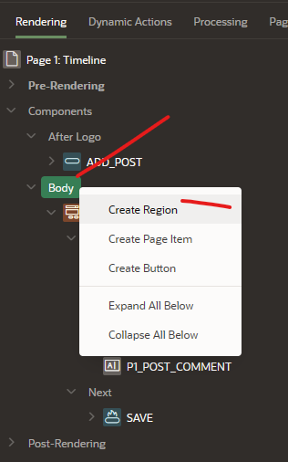
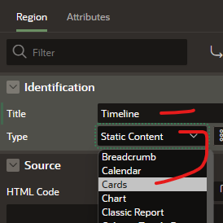
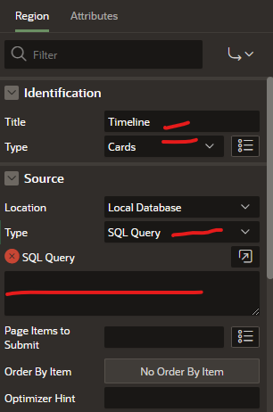
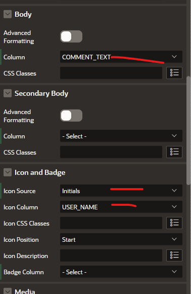

# Build the Cards Region

## Introduction

In this lab, you learn to create the CARDS region that can query the data
the way we need it, and configure the region attributes to suit our
goals.

Estimated Time: 10 minutes

## **Task 1**: Create a Cards Region

1. Navigate to the Rendering Tree and right-click on **Body**, and
choose **Create Region**.   

    

2. Update the following attributes in the Property Editor:

    - Under Identification:
         - For Title, enter **Timeline**
         - For Type, select **Cards**

    

    - Under Source, for Type select **SQL Query**.

3.  Clear the **SQL Query** that was automatically put into the SQL
    Query box. The attributes should look like the following:

    

4.  Copy and paste the following **SQL** statement into that box and
    *tab out* of it

    ```
    <copy>
        select
        p.id,
        p.created_by AS user_name,
        p.post_comment AS comment_text,
        p.file_blob,
        p.file_mime,
        
        apex_util.get_since(p.created) post_date,

        (
            select count(*) from SM_REACTIONS smr 
            where smr.post_id=p.id
        ) as REACTIONS,

        (
            select 'user-has-liked' from SM_REACTIONS smr 
            where smr.post_id=p.id and created_by=:APP_USER
        ) USER_REACTION_CSS

        from SM_POSTS p 

        order by p.created desc
    </copy>
    ```

    And this is the final configuration for the **Region** tab:

    

5. Scroll down on the list of Region attributes to the **Appearance**
section:

    - In the Appearance > CSS Classes box, put **t-Chat**

    - Then *scroll down* to the **Advanced** section and specify
    **timeline** as the **Static ID**

    We're not quite done with this region yet -- we have to configure
which columns from the query results will be used on which parts of the
CARDS themselves.

## **Task 2**: Configure the Attributes of the Cards Region

1. In the Property Editor, select the **Attributes** tab, and make
the following changes:

    - Card > Primary Key Column 1: **ID**

    - Title > Column: **USER_NAME**

    - Subtitle > Column: **POST_DATE**

    

    - Body > Column: **COMMENT_TEXT**

    - Icon and Badge > Icon Source: **Initials**

    - Icon Column: **USER_NAME**

    

    And finally (for this Region), scroll down to the Media section, and set
these attributes:

    - Source: **BLOB column**

    - BLOB Column: **FILE_BLOB**

    - Position: **First**

    - Appearance: **Widescreen**

    - Sizing: **Cover**

    - CSS Classes: enter **selectDisable**

    - Copy and paste **&COMMENT_TEXT.** (including the period!)
    into the **Image Description** box

    - BLOB Attributes > Mime Type Column: **FILE_MIME**

    These attributes should look like this:

    

2. And this completes the region. Click **Save and Run**.

    If you made a post earlier you should now see your image and your
comment text:

    


## **Acknowledgements**

 - **Author** - Jayson Hanes, Principal Product Manager; Apoorva Srinivas, Senior Product Manager; 
 - **Last Updated By/Date** - Apoorva Srinivas, Senior Product Manager, March 2023