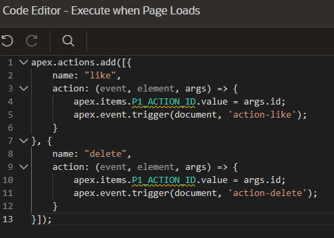
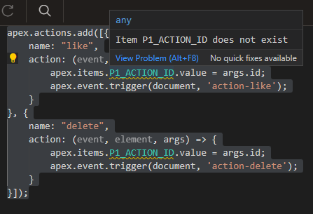
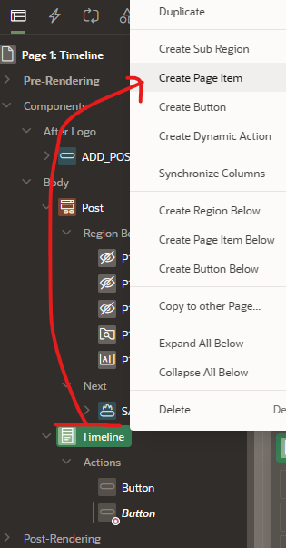
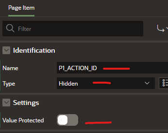

# Customizing the Card

## Introduction

In this lab, you will learn to customize the card in order to add a reaction button and a delete button for a user to like a post or delete a post respectively.

## **Task 1** : Create a Like Button

The Like button will display the current count of likes next to a heart
icon. The user will be able to see the number of likes in total, and they will be able to click the button and add their
like to the post. If the user has already liked the post, the effect of
clicking it again will remove the like. 

1.  In the rendering tree under the **Timeline** Cards Region, right-click on **Actions** and choose
    **Create Action**.

2.  You will see a new sub-entry item titled **Button** and you can
    select it to see the properties on the right.

3.  Copy and paste **&REACTIONS.** (including the period) into
    the **Identification > Label** box. This is called APEX string
    substitution syntax, and it will render the count of reactions as
    the Label for this button, on each post. The **REACTIONS** column is
    defined in the query for this CARDS Region.

4.  We now need this button to have a URL-link that can be hooked up to
    javascript later, so that the database operation can be performed.
    Set the **Link > Type** to **Redirect to URL**.

5.  Now, click the **Target** button so that you can *copy and paste*
    **#action\$like?id=&ID.** (including the period) into the
    URL box, and click OK.

6.  Next, we want to configure the **Appearance** of this button by
    setting the **Display Type** to **Text with Icon** and copying
    and pasting **fa-heart &USER\_REACTION\_CSS.** (including
    the period) into the **Icon** box. The **USER\_REACTION\_CSS** column
    is defined in the query for this CARDS region.

7.  For the **CSS Classes** property, enter **js-heart-button** which will be used by our Dynamic
    Action JavaScript later.

    These properties should now look as follows:

    

    Don't run the app just yet -- as the button will generate a javascript
error because we haven't added that code to the app to make it work.
Since we are creating another button, we'll do that after the next step.

## **Task 2** : Create a Delete Button

Similar to the previous task, we want to create another button that will be used for Deleting posts. We'll add a condition to this
button that only displays for posts that belong to the logged in user:

1.  Right-click the **Timeline > Actions** entry in the rendering
    tree, and choose **Create Action**.

2.  In the Property Section, update the following attributes:
    - Under the **Action** tab, set the **Label** to **Delete**.

    - Under **Layout > Position**, choose **Secondary** (so that it's on
    the right side of the card)

    - Under **Link**, change the **Type** to **Redirect to URL**.

    - Click on the **Target** button and enter
    **#action\$delete?id=&ID.** and then *click* on the **OK**.

    - In the **Appearance** section, change the **Display Type** to **Icon** and for Font-APEX CSS class, enter 
    **fa-trash-o**.

    - Finally, lets define the **Server-side condition** that controls
    whether or not this **button** shows up per card by setting the
    **Type** to **Expression**, and the **Language** to **PL/SQL**.

    - Under **Server-side conditions**, for **PL/SQL expression**, enter **:USER\_NAME=:APP\_USER**
    
    This expression will compare the query column value returned to
    the currently signed-in APEX user. This colon-prefixed "variable"
    syntax is called "Bind Variable Syntax" in PL/SQL. If it evaluates
    to true (for each row or Card) then APEX will render the **Button**,
    otherwise it won't.

    The result of these steps should look like the following:

    

## **Task 3** : Add Javascript to the Page for the Card Buttons

In this task we will provide the APEX page with the custom javascript
that will be invoked by the "URL link" from the Cards button link
targets, to the Dynamic actions that we will create in Lab 8.

1.  Select the **Page 1: Timeline** entry in the **Rendering Tree**
    and review the attributes for the **Page** in the Property section
    on the right. Scroll down to **Execute when Page Loads** section,
    which is currently empty.

2.  *Copy and Paste* this javascript code into that box:

    ```
    <copy>
        apex.actions.add([{
        name: "like",
        action: (event, element, args) => {
            apex.items.P1_ACTION_ID.value = args.id;
            apex.event.trigger(document, 'action-like');
            }
        }, {
        name: "delete",
        action: (event, element, args) => {
            apex.items.P1_ACTION_ID.value = args.id;
            apex.event.trigger(document, 'action-delete');
            }
        }]);
    </copy>
    ```

    

    Open the Code Editor to see the entire script.

    
    
    

    Notice that the code references a Page Item, **P1\_ACTION\_ID** with a squiggly underline, which we have not created
yet.

    

3. We need this Page Item **P1\_ACTION\_ID** to be on the page so that this
javascript can store the particular CARD **ID** when a user clicks
either buttons, which in turn, will execute either the **like** or the
**delete** operations from the URL link targets. This is a design
pattern using a single APEX Javascript API call (on page load) with an
array of multiple code blocks as parameters. Each respective javascript
block will then in-turn call a custom event, which we'll configure our
Dynamic Actions to respond to in the next task.


4.  To create and configure **P1\_ACTION\_ID** Page Item, right-click on the **Timeline** Cards Region in the **Rendering Tree** and choose **Create Page Item**.

    

5.  APEX will default set **Page Item** > **Name** with the Prefix of
    **P** and the **Page Number** followed by an underscore (**\_**),
    and **NEW** in this case, as **P1\_NEW** -- we want to edit this name
    to be **P1\_ACTION\_ID** in the **Page Item > Identification > Name** field.

6.  We also want to change the **Type** to **Hidden**

7.  And, finally set the **Settings > Value Protected** option to
    **OFF**.
    
    

8. We need to unprotect this hidden **Page Item** because we'll be
writing to it via our Javascript.

    Now, let's go back and select the **Page 1: Timeline** Rendering Tree
entry, and open up the code editor again to see the javascript we copied
and pasted earlier:

    

    The code editor looks clean with no concerns!

9. **Save and Run** the page to see how the app is shaping up, granted, this
doesn't look to be as huge a leap visually, but functionally, we're
almost there!

    


## **Acknowledgements**

 - **Author** - Jayson Hanes, Principal Product Manager; Apoorva Srinivas, Senior Product Manager; 
 - **Last Updated By/Date** - Apoorva Srinivas, Senior Product Manager, March 2023
